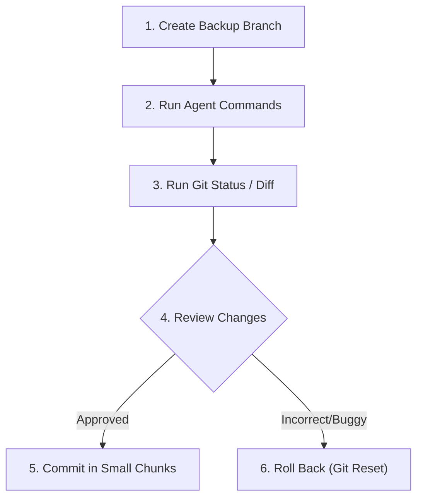

# Audit Log & Rollback Workflow

When using AI agents that write files, establish a git-driven control loop to review modifications and undo incorrect commands.

---

## 🔄 The Defensive Version Control Loop

Follow these steps before, during, and after every session with an active write-agent:



---

## 📋 Step-by-Step Rollback Workflow

### 1. Pre-Run: Create a Backup Branch
* Before starting the agent, ensure your workspace is clean. Create a temporary checkpoint branch:
  ```bash
  git checkout -b sandbox/agent_run_session
  ```

### 2. Intermediate Checks: Run Git Status & Diff
* Regularly run these commands in a separate terminal window to inspect file changes:
  ```bash
  # Check which files have been modified or created
  git status

  # Review exactly what code was added or deleted
  git diff
  ```

### 3. Commit Small
* If the agent completes a specific task successfully (e.g. implementing a linter configuration), commit it immediately before asking it to do more:
  ```bash
  git add .
  git commit -m "completed task: added lint configuration"
  ```
  This creates clean recovery points.

### 4. Rollback Checkpoints
* If the agent makes destructive changes or writes buggy code, use standard git rollbacks:
  ```bash
  # Undo all uncommitted changes in the workspace
  git reset --hard HEAD

  # Remove untracked files and directories created by the agent
  git clean -fd
  ```
* If you need to discard the entire session and return to your master code:
  ```bash
  git checkout master
  git branch -D sandbox/agent_run_session
  ```
